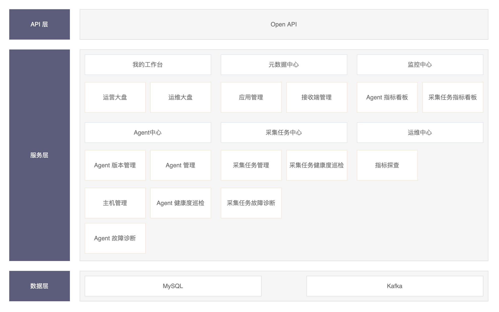

# Know Agent 一站式日志采集平台

## 诞生的背景

​	滴滴有很多的实时、离线计算任务与数据同步任务，这些任务所涉及到的数据源有很大一部分是散落在各主机上的业务日志与系统日志，涉及的主机数量非常之多（10万+），更关键的是，这些任务有的服务于财务类指标，有的服务于安全、风控类指标（这类指标对应的日志类数据源的数据量非常之大，单个日志文件每秒持续日志写入量达50MB+），有的服务于运维保障，场景复杂多样，侧重点也各有不同，保障等级也各不一样。总结起来，这些计算任务对数据的完整性、实时性要求非常之高。

​	例如有一个涉及财务指标的实时计算任务，实时计算链路如下图：

​	实时计算任务对数据的完整性保证依赖于链路中各个组件对数据的完整性保证，链路中 Kafka -> Flink -> Elasticsearch 的数据完整性可保证，但日志数据 -> Kafka，这部分的数据完整性却很难得到保证，这里主要有如下两方面的原因：

1. 采集引擎自身问题：例如写入下游 Kafka 出错时采集引擎宕机导致丢失写入失败的那批数据问题、 inode 复用导致的漏采问题等。
2. 业务方问题：例如配置的文件路径在实际的主机上不存在、日志切分规则配置出错、单行日志过大，日志输出时序错乱等问题，这些原因都会影响数据的完整性。

​	整个实时计算任务需要采集侧回答一个问题：“某个时间点之前的数据是不是可计算了”？这需要采集侧在确保自身不会影响数据完整性的同时，能及时、准确的感知所有因业务方导致的数据完整性得不到保证的情况。

​	除此以外，超大规模采集引擎集群的运维保障也是一个坑。首先是采集引擎复杂的采集配置就是一个极易出错的环节，而且配置出错以后往往无法及时发现，通常需要通过业务方反向传至运维方才能感知配置错误，这甚至会影响到业务的正确运行，如何降低运维人员配置采集引擎的心智负担，提升配置体验？

​	再者，如何做好采集引擎的可观测性，能帮助资深采集引擎运维人员或采集引擎研发人员尽快定位、问题？以往，运维人员或研发人员定位故障问题或性能瓶颈点，通常需要借助很多第三方工具、登录采集引擎宿主机去查看相关指标、日志，费时费力、效率低下不说，主要是很多关键指标因没能及时采集，导致定位问题时无法通过这些关键指标定位问题线索，只能靠日志、源码、经验在脑海中复现问题发生现场，这不是一般运维与研发人员做的来的，换句话说，如果没有良好的可观测性，将大幅提高问题定位门槛与成本。

​	最后，如何做好超大规模采集引擎集群的治理，能将超大规模采集集群的运维保障工作平滑地交付缺乏采集引擎先验知识的普通运维团队？这些都是必须要解决的问题。

## 遇到的问题

​	这里总结一下我们所遇到的问题：

- 采集引擎自身不够可靠，性能不足，无法实现采集任务的多租户隔离、分类保障。
- 采集引擎无法感知因业务方导致的影响数据完整性问题。
- 采集任务不易融入整体计算任务，进行数据条带化传输、管理。
- 超大规模采集引擎集群的运维保障问题。

## 需要什么？

​	明确了问题，就可以转化为需求了，我们需要什么呢？

### 采集引擎

#### 高可靠、高性能

​	首先，我们需要一个高可靠、高性能的采集引擎。可靠性上，可确保在任意情况下（除：待采集数据在被采集前被移除，例如：日志文件被归档或日志文件滚动速度太快导致），不会因采集引擎自身破坏数据完整性。性能上，可实现单日志文件至少100MB+每秒的持续采集能力。

#### 条带化、多租户

​	其次，采集引擎可实现采集任务的数据条带化传输、管理，与多租户隔离、分类保障。

#### 对数据完整性具备感知能力

​	再者，采集引擎需要对所有因业务方配置不正确或业务数据质量不达标（如：单条数据过长、时序乱序打印等）导致可能破坏数据完整性的情况，以指标的形式感知、并上报。

#### 可观测性

​	最后，采集引擎需要具备以指标的形式透视采集引擎自身、采集引擎运行环境（如：操作系统）与各采集任务运行过程的能力。可观测性的背后是完善的指标体系，这样的指标体系必须构建在对采集引擎的深度掌控能力、以及大量业务数据采集场景的实践使用经验之上。指标类型应囊括：

- 系统级指标
- 进程级指标
- 业务级指标
  - 采集引擎相关的业务指标
  - 采集任务相关的业务指标

​	上报的内容除了指标以外，还包括采集引擎输出的错误日志。

### 管理平台

#### 可管控

##### 采集任务面向应用而非面向机器

​	平台需要支持面向应用的采集任务配置而非面向机器（组）的采集任务配置。以往的一些采集引擎管理平台，在下发采集配置的过程中，往往是面向机器的，比如：某个采集配置下发至哪台机器或哪个机器组。然而日志一定是作用于业务的，机器 - 业务还有一层，这大大增加了维护人员操作复杂度。

##### 采集引擎易接入

​	接入包括两块：

1. 采集引擎：采集引擎支持自动注册，自动上报其宿主机信息，上报的宿主机信息可作为元数据的一部分。
2. 元数据：元数据包括主机、应用、以及主机-应用关联关系。元数据信息即可通过界面操作手动维护，也可通过文件导入、与 CMDB 自动同步方式进行维护。

##### 采集任务易配置

​	采集任务的配置需要做到如下三点，使用户配的少、配的稳、配的省心：

1. 区分普通配置项与高级配置项：普通配置项能囊括绝大部分的场景与需求，剩余的部分（如：极限性能调优）供高级用户按需进行配置。
2. 可预览、可验证：比如，
   - 预览配置的待采集文件路径对应的文件内容。
   - 预览配置的待采集文件路径的父目录下有哪些文件。
   - 验证配置的待采集文件路径在某主机上是否存在。
   - 验证配置的待采集文件路径与文件名后缀名匹配正则是否能正确匹配出期望的文件集。
   - 验证日志切片规则作用在配置的待采集文件路径对应的文件内容上，得到的日志切片结果是否符合预期。
3. 尽量少让用户填写：比如，对于日志切片规则相关的配置项，尽量让用户通过鼠标划取的方式进行自动识别、填充，并针对预览的数据进行验证。
4. 配置纠错：在采集任务配置完成以后，对于配置存在错误的采集任务配置项，会在稍后的采集任务健康度巡检中被找出，并提示、引导用户进行修正。

##### 十万级采集引擎与十万级采集任务的纳管能力

​	纳管能力主要体现在如下三个方面的能力：

1. 管理平台需要具备可靠的支撑十万级采集引擎并发拉取采集配置的能力。
2. 管理平台需要在给定时间内完成十万级采集引擎与十万级采集任务的健康度巡检、诊断流程。
3.  采集引擎上报的指标数据从上报到入库整体耗时需要控制在10秒以内。除此以外，采集引擎上报的指标数据写入、查询相关接口，需要支持各类存储引擎（如：MySQL、Elasticsearch、TSDB等），并支持以增加管理平台实例数的方式水平扩展指标数据写入下游存储的吞吐量与性能。

#### 可观测

​	可观测性面向的主要用户群体为采集引擎资深运维人员与采集引擎研发人员，主要目的为了排障与性能调优。平台需要基于采集引擎上报的指标，体系化、分级化、立体化的展现给用户，并辅以日志，让用户在绝大多数场景下，通过平台上的自助分析看板一站式、快速定位故障问题与性能瓶颈点，而非借助第三方工具或登录采集引擎宿主机去定位。

##### 体系化

​	首先，采集的指标需要全面且体系化。指标分两类，一类为采集任务相关指标，一类为采集引擎相关指标。以采集引擎为例，不仅需要采集涉及采集引擎自身的业务指标，还需要采集引擎进程级、与系统级相关指标。采集的系统级指标、进程级指标，也需要进一步分门别类。

##### 分级化

​	然后，指标需要分级展示，而不是一股脑全部展示给用户。以采集引擎为例，首先展示的是涉及故障、流量相关的黄金指标；其次展示的是系统级、进程级、业务级涉及关键资源项使用情况、饱和度相关指标；最后，用户根据具体情况，可自主查询其他指标项。

##### 立体化

​	最后，指标需要立体化展示。比如：某个采集任务在某台主机上的采集延时很大，这个时候不仅需要查看采集任务的相关业务指标（如：限流时长、channel使用率等），还需要查看这台主机上的采集引擎相关业务指标、系统级指标、进程级指标，所有这些指标，需要通过时间轴串起来立体化展现。

#### 可治理

​	治理能力是运维大规模采集引擎集群的必备能力，治理能力本质上是基于完善的指标体系之上的隐性专家经验显性的流程化、产品化能力。治理能力面向的是普通运维人员，无需采集引擎方面的先验知识。通过对全量采集引擎与采集任务的健康度巡检、诊断，辅助用户发现、解决问题，感知风险。

## 为何不选开源采集引擎

​	市面上不缺乏开源的采集引擎，例如：Flume、Filebeat，但这些采集引擎无法同时满足可靠、高性能、易扩展的特性。例如：

- Flume：性能低下，资源耗费高，在数据完整性上存在因inode复用导致的漏采问题，以及多租户隔离问题等。
- Filebeat：在数据完整性上也存在因inode复用导致的漏采问题，单一队列架构使其无法满足多租户隔离性并且受限于其架构设计局限，不利于重构。

​	基于上述原因，决定自研采集引擎。

# 整体设计	

​	Know Agent 是一站式的日志采集平台，包括两个组件：

- Agent：是基于 Java 的高性能、支持多租户隔离的采集引擎，它能在任意情况下（除：待采集数据在被采集前被移除，例如：日志文件被归档或日志文件滚动速度太快导致）保证采集数据的完整性，持续采集速度可达150MB+/秒。
- Agent Manager：是针对 Agent 的管理平台。用于管理相关元数据、Agent与采集任务，自动巡检 Agent 与采集任务的健康度、故障诊断，指标展示。

	

​	Know Agent 最小外部依赖组件有 2 个：

1. MySQL：用于存储 Agent Manager 元数据，与 Agent 上报的指标、错误日志数据（Agent上报的指标、错误日志支持Elasticsearch存储以应对大规模的 Agent 集群管控）。
2. Kafka：作为采集的日志数据、以及 Agent 上报的指标、错误日志数据的消息总线。

​	Agent 有三个数据流：

1. 日志数据流：用于将采集的日志数据上报至Kafka。
2. 指标流：用于将Agent、采集任务相关指标上报至Kafka。
3. 错误日志流：用于将Agent错误日志上报至Kafka。

​	Agent Manager 启动后会持续消费 Agent 指标流与错误日志流对应的 Topic，然后将指标、错误日志数据根据配置写入对应存储（默认存储为MySQL，存储类型支持：MySQL、Elasticsearch，并支持通过接口方式扩展其他存储），Agent Manager 将根据这些数据对所管控的 Agent、采集任务进行健康度巡检、故障诊断，以及指标展示。

## Agent 架构

### 核心概念

- **Source：**输入源，一个Pipeline仅包含一个输入源，输入源支持多种类型，如File型输入源。
- **Limiter：**限流器，根据配置的流量阈值与CPU使用率阈值进行限流。
- **Queue：**队列，目前有内存队列。
- **Interceptor Chain：**拦截器链，数据流经过Interceptor Chain被链式处理。
- **Sink：**输出源，一个输出源对应一个Interceptor Chain，输出源支持多种类型，如Kafka、Elasticsearch。
- **Sink Group：**输出源组，多个 Interceptor Chain/Sink 共同组成一个 Sink Group，一个Pipeline包含一个输出源组，输出源组内的多个输出源并行处理。
- **PipeLine：**管道，Source/Limter/Queue/Interceptor Chain/Sink共同组成一个Pipeline，不同的Pipeline数据隔离。
- **Monitor Event Bus：**各组件监控数据的暴露、发送，监控数据包括：指标、错误日志。
- **Config Reloader：**配置的动态更新。

## Agent Manager架构

## 特性

### 一站式日志采集方案

​	高可靠、高性能、具备全方位可观测性的采集引擎，与面向应用的易管控、易观测、易治理的管理平台，大幅降低日志数据采集接入成本，大幅提升日志数据采集接入效率。

### 易融入流式计算

​	面向应用的采集任务、高可靠的采集引擎可确保在任意情况下的数据完整性、完善的监控指标，支撑可靠的采集任务的数据完整性校验，这使得采集任务可作为流式计算的一种可靠的数据源，形成整个流式计算链路的数据完整性闭环。

### 生产级特性

​	经过长时间在各场景下大规模采集引擎集群运维沉淀的专家经验，形成了全方位的可观测性与完善的故障、风险感知与诊断能力，使较少的无需采集引擎先验知识的普通运维人员亦能轻松运维庞大的采集引擎集群。

### 高性能

​	优异的持续采集性能，基于jdk11+，处理单行、单文件、无解析场景下发送日志数据至kafka，持续吞吐量可达100MB/s以上，极限吞吐量可达150MB/s以上，CPU限制单核情况下，持续吞吐量可达40MB/s以上。

## 同类对比

|         维度         |            Flume             |           FileBeat           |                          Logi-Agent                          |
| :------------------: | :--------------------------: | :--------------------------: | :----------------------------------------------------------: |
|        可靠性        |             一般             |             一般             |                            高可靠                            |
|       采集性能       |             Mb级             |            十Mb级            |                            百Mb级                            |
|      数据完整性      |      无法确保数据完整性      |      无法确保数据完整性      |                       可确保数据完整性                       |
| 采集任务级的租户隔离 | 无法做到采集任务级的租户隔离 | 无法做到采集任务级的租户隔离 |                  可做到采集任务级的租户隔离                  |
|       可扩展性       |             良好             |             一般             |                             一般                             |
|       资源消耗       |              高              |              低              | CPU消耗与FileBeat趋近（大采集量场景下CPU消耗较FileBeat更小），内存消耗较FileBeat略大（但在一个数量级上） |
|  监控指标的完善程度  |           较少指标           |           较少指标           |                        完善的指标体系                        |
|       可观测性       |              无              |              无              |                     具备全方位的可观测性                     |
|     是否容易配置     |              否              |              否              |                              是                              |
|   大规模运维复杂度   |             极高             |             极高             |                              低                              |

## **展望**

未来我们会在以下几个方面进行持续改进：

**Agent**

- 支持完善的目录采集
- 更好的可扩展性：插件化的 Source、Sink、Interceptor Chain、序列化协议，为数据采集多样化、生态化奠定基础
- 具备 Aggregator 能力，并插件化，便于 IOT 数据采集
- 更高的采集性能与更低的资源消耗
- 支持更多平台
- 支持云原生数据采集

**Agent-Manager**

- 不同类型采集任务管理、健康度巡检、故障诊断能力插件化
- 不同类型的接收端管理能力插件化
- 支持目录型采集任务的健康度巡检、故障诊断
- 更好的采集任务配置体验
- 更好的可视化体验

**持续回馈开源社区**

​	Know Agent 已经开源（项目地址：https://github.com/didi/LogiAM），作为在滴滴内部经过多年的大量复杂、核心场景验证过的采集引擎与管控平台，我们会持续对其进行核心业务抽象，回馈社区，我们也希望热心的社区同学和我们交流想法，共同提升 Know Agent 的功能和体验。
