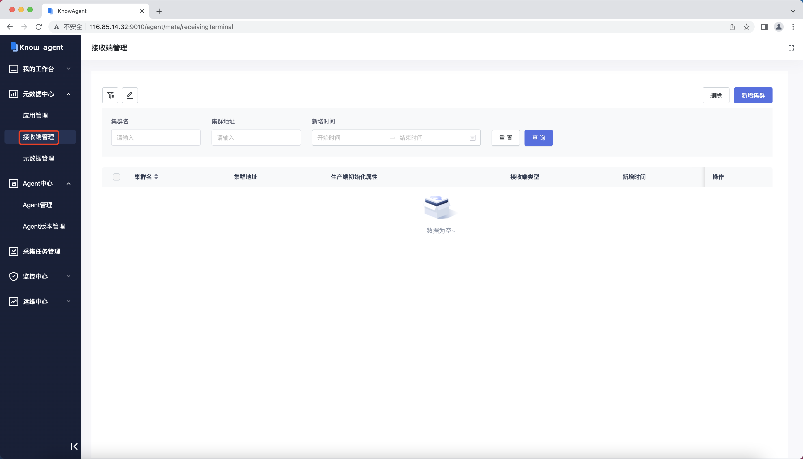
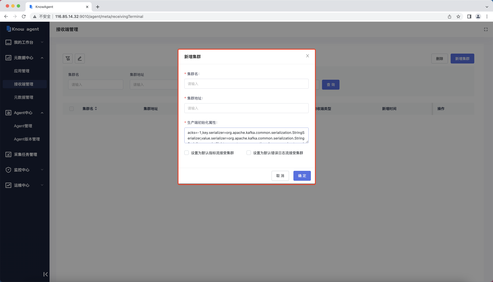
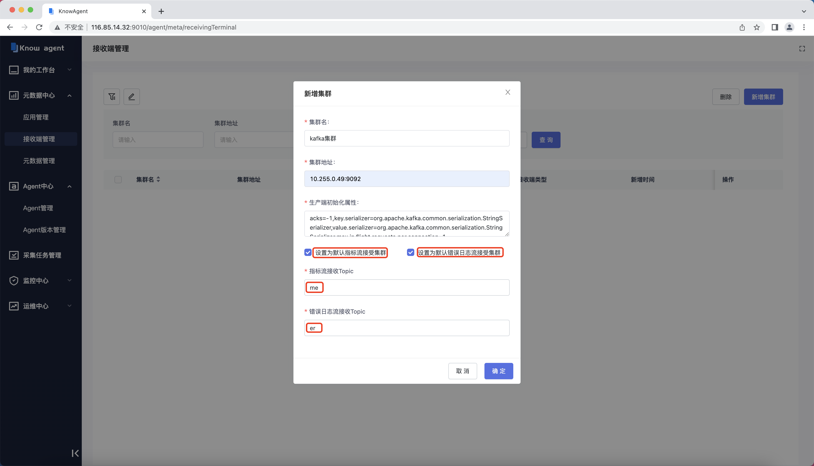
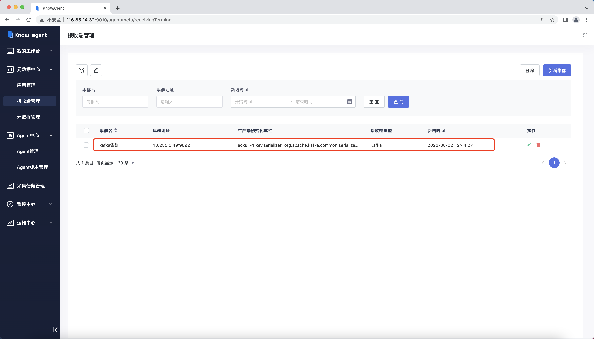
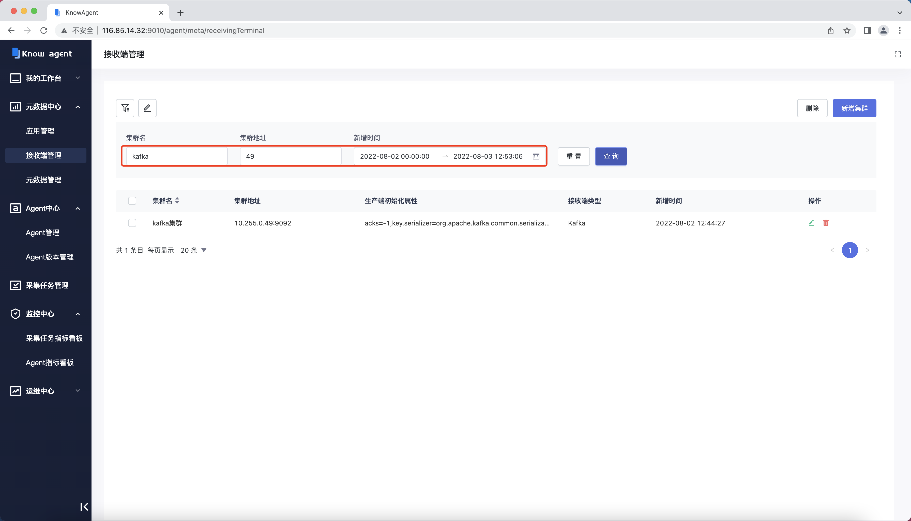
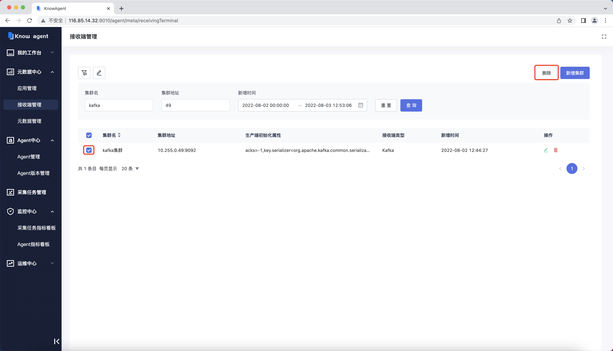

# 元数据管理

​	元数据包括：接收端、主机、应用。

## 接收端

### 前置说明

​	在您配置接收端信息前，请您安装好 Kafka，确保 Kafka 与 Agent-Manager、Agent 所在主机的网络连通性，并创建用于存放 Agent 数据流、指标流、错误日志流数据的 Topic。

### 配置接收端

​	接收端表示 Agent 数据流、指标流、错误日志流对应数据流向的下游组件，目前 Agent-Manager 仅支持 Kafka 类型接收端。当您进入Agent-Manager管理平台以后，点击左侧菜单栏中`元数据中心 - 接受端管理`，如下图：

​	初始状态下，未配置任何接收端信息，因此请您先统一配置 Agent 数据流、指标流、错误日志流数据对应下游接收端信息。点击右上方的`新增集群`按钮，进入新增集群页，如下图：

- `集群名`输入框：请填入您安装好的Kafka集群名。
- `集群地址`输入框：请填入您安装好的Kafka集群对应broker地址列表（如：10.255.0.49:9092，多个 broker 地址间采用逗号分隔）。
- `生产端初始化属性`输入框：具有默认值，您也可以根据您的特殊场景需求进行调整（如：序列化方式、压缩方式、安全等）。

​	如您需要将该 Kafka 集群作为 Agent 指标流、错误日志流数据的下游接收端，请您勾选`设置为默认指标流接受集群`与`设置为默认错误日志流接受集群`复选框，并在`指标流接收Topic`与`错误日志流接收Topic`输入框中，选择您为存储 Agent 指标流、错误日志流数据创建好的 Topic，如下图：

​	点击`确定`按钮，接收端新增成功，在接收端管理页可看到刚刚新增成功的接收端记录，Agent 接入以后将自动采用该接收端信息作为其指标流、错误日志流数据的下游接收端，如下图：

### 查询接收端

​	在接收端管理页可根据`集群名、集群地址、新增时间`对系统已有接收端信息进行查询，`集群名、集群地址`支持模糊查询，如下图：

### 删除接收端

​	在接收端管理页下方表格中针对需要删除的接收端记录，在其右侧操作列点击对应删除按钮，即可对其进行删除，如下图：

​	如需要删除多条接收端记录，在接收端管理页下方表格中针对需要删除的接收端记录，在其左侧复选框进行勾选，勾选完毕以后点击页面右上方的删除按钮进行批量删除，如下图：	

## 主机与应用管理

​	

# Agent 管理

## Agent 配置

# 采集任务管理

